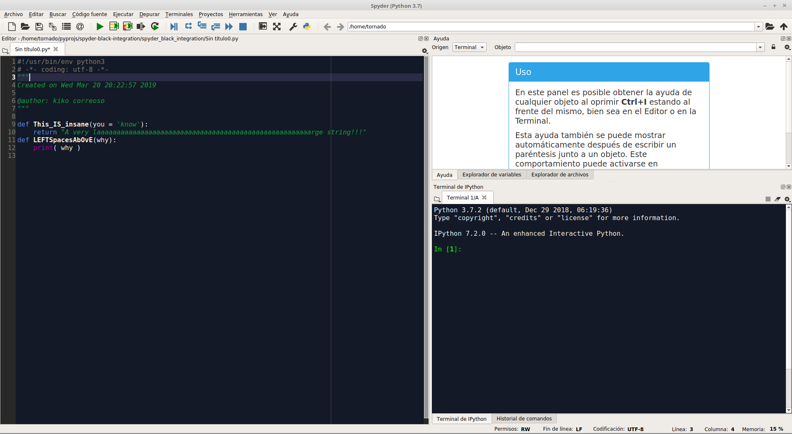
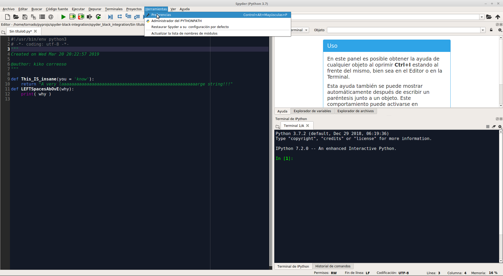
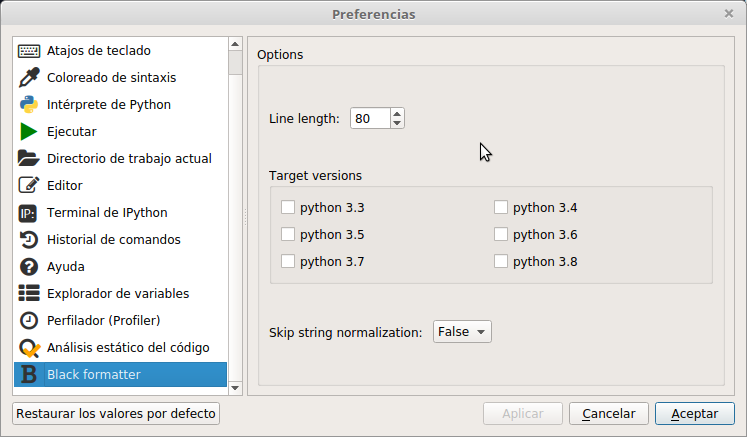
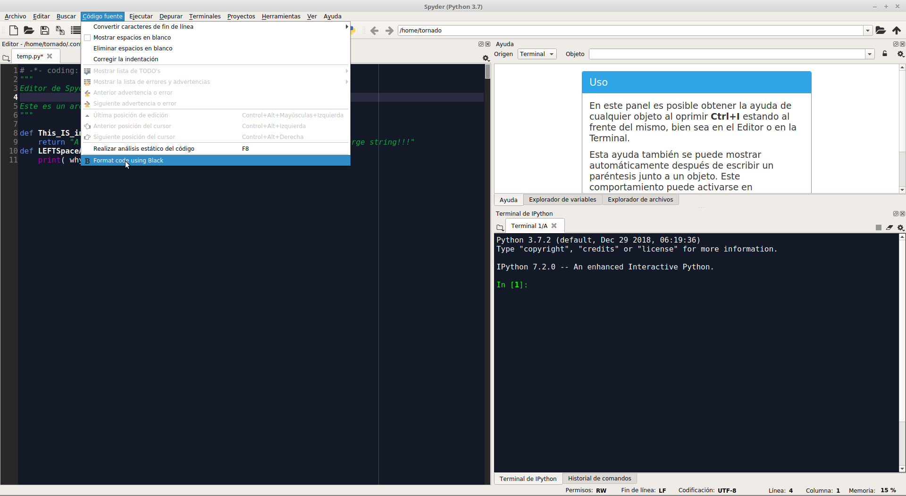
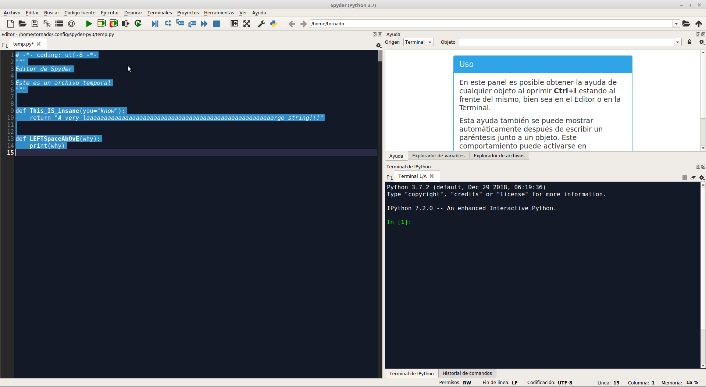

Spyder IDE black formatter plugin
=================================

Description
-----------
Spyder IDE plugin to format code using `black <https://github.com/ambv/black>`_.

The source code in this repo is heavely inspired in the previous work make by
others in this `repo <https://github.com/spyder-ide/spyder-autopep8>`_.

Installation
------------

Using pip
::

    pip install git+https://github.com/kikocorreoso/spyder-black-formatter.git

Using conda (what I think it is the easiest way)
::

    conda install conda-build
    git clone https://github.com/kikocorreoso/spyder-black-formatter.git
    cd spyder-black-formatter/
    conda develop .

Uninstallation
--------------

Using pip
::

    pip uninstall spyder_black_formatter

Using conda
::

    cd /path/to/spyder-black-formatter/ # local repo from where it was installed
    conda develop -u .

Usage
-----

It is as easy as pressing "SHIFT+F5" and the active file in the editor will be formatted.

Here you have your code:

If you want to setup the way **black** will format your code you should go to "Tools > Preferences":

And the following window will pop up:

Once it is done you can press "SHIFT+F5" or go to "Source code > Format code using black":

After that the source code of the active window in the editor should be formatted with your preferences:

License
-------

MIT (see License.txt in this repository).

